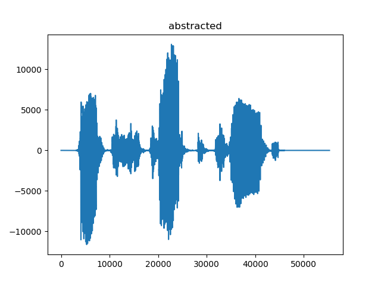
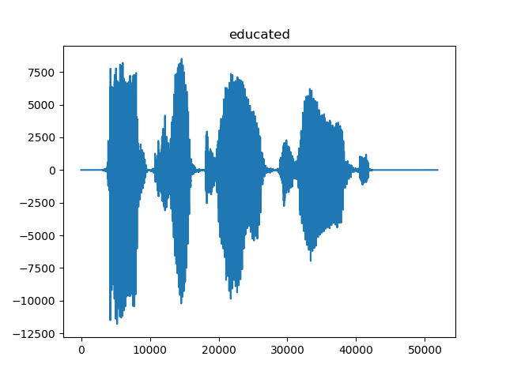
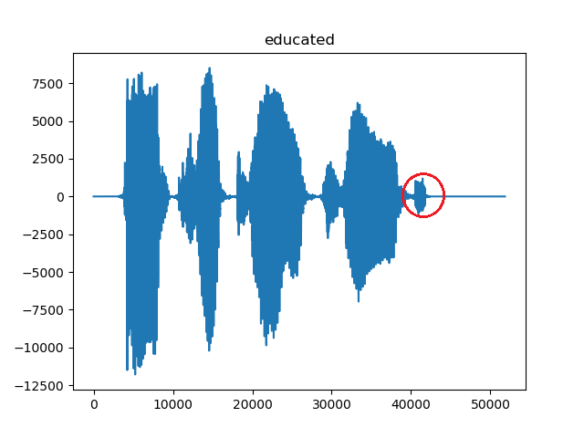
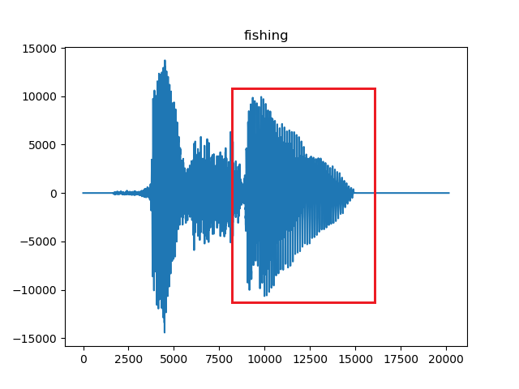
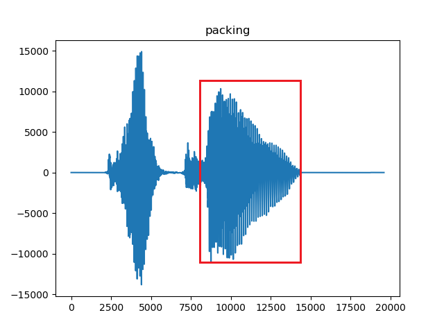

  

<h1 align="center">WaveCompartor</h1>

  
  
  
  
  
  

<h4 align="center">Compares two sound waves to determine whether they are similar or not.</h4>

## How it works

Words which sound similar have relatively similar wave in their corresponding region.
 

For Example, when you look at the sound waves of words _abstract**ed**_ and _educat**ed**_

 
 
 
 
 
 
 
 
 
 
 
 
 
 
 
 
 
 
 

The common thing in both words is **ed** at the end. And this is clearly getting reflected in the waves (Region in red circle).

 
 
 
 
 
 
 
 
 
 
 
 
 
 
 
 
 

Another example is the words ending with **ing**

 
 
 
 
 
 
 
 
 
 
 
 
 
 
 
 
 

We use this concept to determine whether the given words are similar or not.

## Authors
  - Sushant Patrikar - [sushantPatrikar](https://github.com/sushantPatrikar)
  - Yash Sharangpani - [yash-sharangpani](https://github.com/yash-sharangpani)

## Future Scope
Right now, our code only works on the words which have similar endings. Further addition can be done to detect the similarity not just at the end, but anywhere in between the two words.

